# Projektni zadatak

## Opis

Izraditi web sjedište (site) za neku proizvoljnu temu ili klijenta, te ga objaviti. Projekt mora zadovoljiti slijedeće uvjete:
* Izvorni kod mora biti objavljen na GitHub-u
* GitHub projekt mora imati „markup” opis projekta
* Web site mora biti objavljen (npr. GitHub Pages i sl.)
* Koristiti Bootstrap ili neki sličan CSS framework
* Web site mora imati zaglavlje (header) i podnožje (footer) s navigacijskim i vanjskim linkovima
* Web mora biti responsivan
* Poželjno da naslovna stranica bude „one-page” stranica (sav bitan sadržaj na njoj)
* Obavezno imati još dvije dodatne stranice: „O meni” + neka od: kontakt, FAQ, Izjava o privatnosti, Izjava o kolačićima i sl.

## Predaja projekta
* Po završetku projekta poslati na mail adrese sbuljat@unizd.hr i nvrdoljak@unizd.hr s linkovima na GitHub stranicu projekta i GitHup Pages stranicu rada. 
* Ocjena rada utjecat će od 5-15 % na vašu završnu ocjenu.

## Moguće teme
* Restoran (uvod, ponuda dana, o nama, meni, preporuka chefa, ostale usluge, slike, osoblje, rezervacija…)
* Teretana (uvod, usluge, tjedni raspored, sadržaj, treneri…)
* Događaj (opis, raspored, promo sadržaj, nadolazeći događaj, vijesti, registracija, cijene…)
* Agencija (usluge, marketing, nekretnine, consulting, putovanja, vjenčanja…)
* Proizvodi (popis, detalji, način plaćanja, način isporuke, osvrti kupaca…)
* Ustanova (škola, sveučilište, zapošljavanje, obrazovna institucija)
* Blog
* Ostalo

## Pomoćni elementi

### Zaglavlje s navigacijskom trakom
* Koristiti ```<nav>``` tag, a iz [Bootstrap primjera](https://getbootstrap.com/docs/4.5/examples/) (Navbar) se može vidjeti kako ih 
implementirati.

## Primjeri sekcija


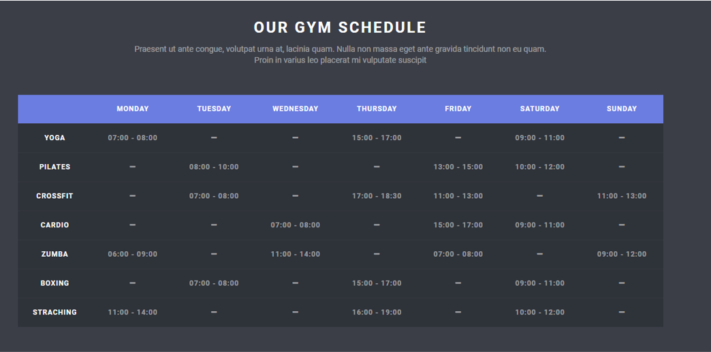

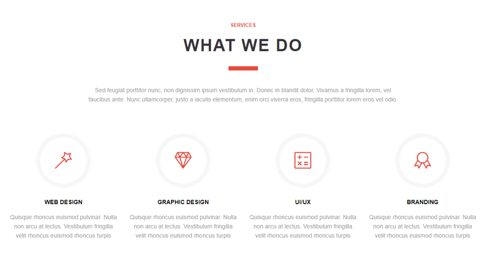


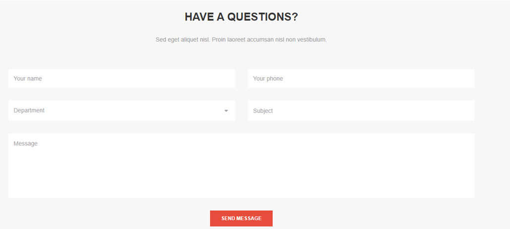


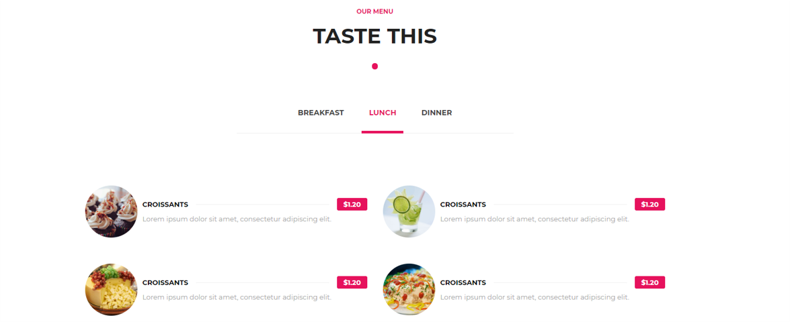

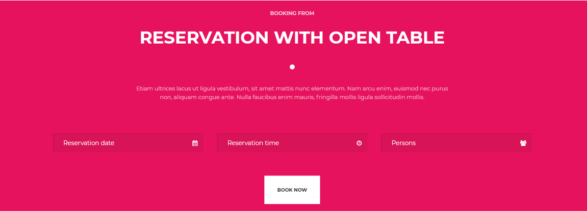

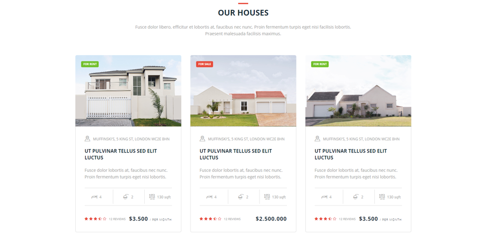

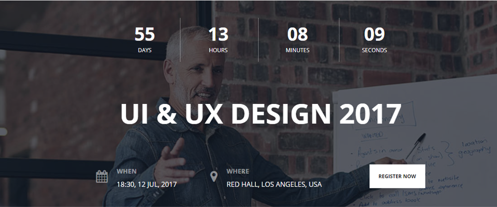

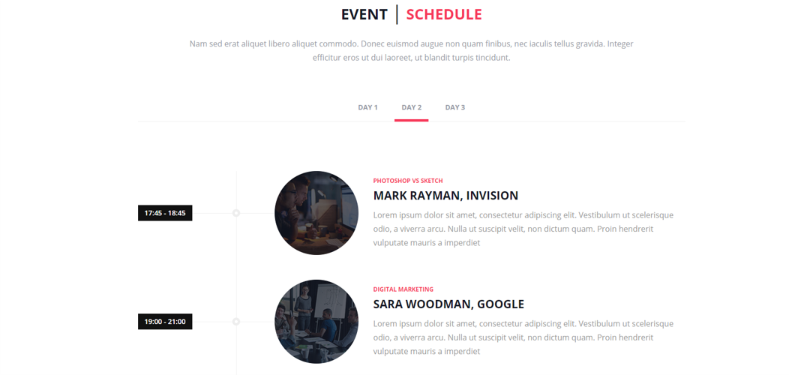

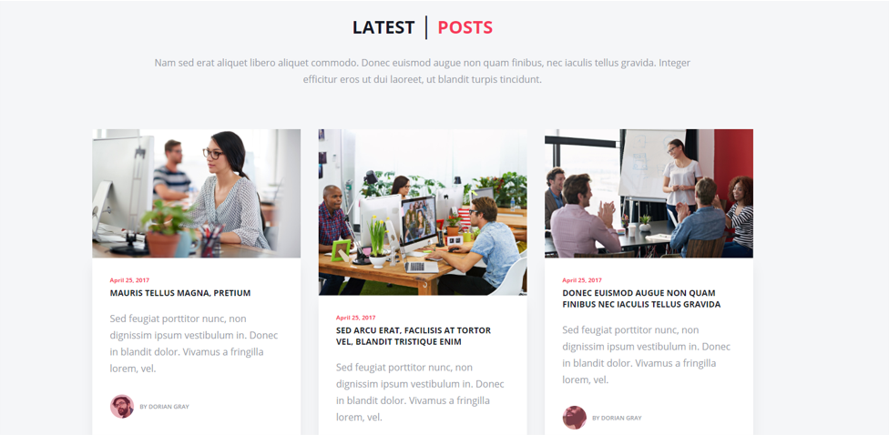

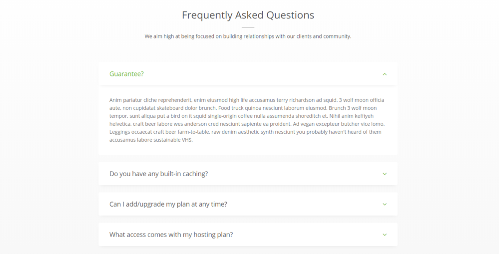

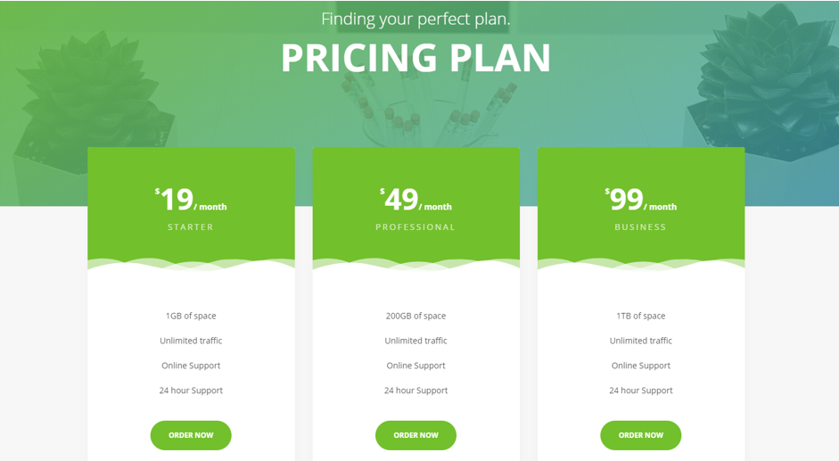

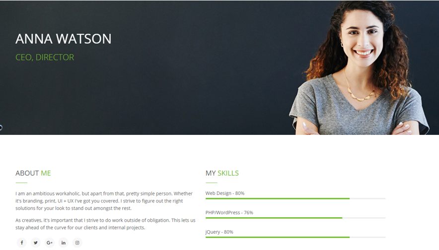


[🏠 Početna](../../.) | [📃 Povratak](../.)
